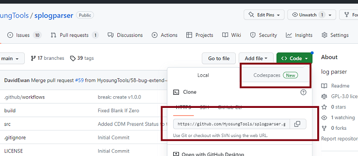
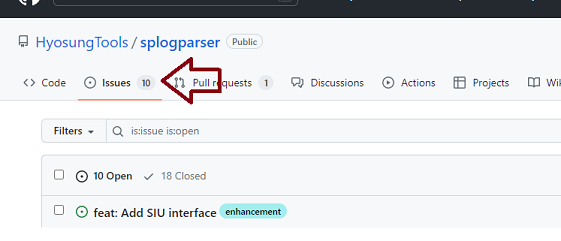

# Making Changes

In this section we will be walking through how to make a change. Some of the instructions you will have to do in GitHub, some on your laptop. 

## Some Basics

First some general guidelines on what makes a good change.

- Only minimum change sets will be accepted. The change must be focused and purposeful; the change should match the original request; the commit description must match the change. No surprises. You can do house-keeping or refactoring of code but that must be under a separate and well defined change request.

- The only coding standard is that the code must all look the same. It has to look like one person wrote the whole thing.

- Testing code coverage must be equal or better for each change request.

To discuss how you can make a change we will use `splogparser` as an example but the same will be true for all tools.

## Git Clone

From a cmd.exe navigate to the folder where you hold all your Git repositories (e.g. `C:\Git`). Execute `git clone` using clone argument provided by Git (see image below):



For example:

```text
C:\Git\git clone https://github.com/HyosungTools/splogparser.git
```

This should create the folder `C:\Git\splogparser` and within will be mainline source.

Notice GitHub now provides Codespaces. Codespaces are cloud based development environments. I've heard about this but never used it. I dont think you have to develop on your laptop at all anymore. That said, for these examples I will assume you are.

## Issues

All changes start with an GitHub Issue.



An issue is just a suggested change; it can be a feature enhacement or bug fix. If you assign your self an issue make sure you:

- set yourself as assigned
- label it correctly

Most important - create a branch for the work. Do this in GitHub. All issue work must be on a separate branch. Also note only I am allowed to merge into main, so do all your Issue work on a separate branch.

## Branch

As mentioned above all work happens on a branch. Having created the branch in GitHub you now need to refresh your local repository. Using splogparser as an example, execute the following git commands:

```text
C:\Git\splogparser\git fetch origin
C:\Git\splogparser\git checkout <branch name>
```

The first command will pull down from GitHub all changes to the repository including the branch you just created. The second command will move you onto that branch for work.

Do all your work on that branch.

## Commit

When you are finished your work you can commit your changes. All commits must be well documented.

## Pull Request

Once you have pushed your commit back up to GitHub, back in GitHub you can create a pull request. When you create a Pull Request all unit tests are run; that's the first text. The second test is a code review.

## Merge

All merges are done by me. When a Pull Request is merged into mainline it also runs all unit tests.

## Merge Conflict

TBD.

## Delete Branch

When the merge is complete the default action will be to delete the branch.
